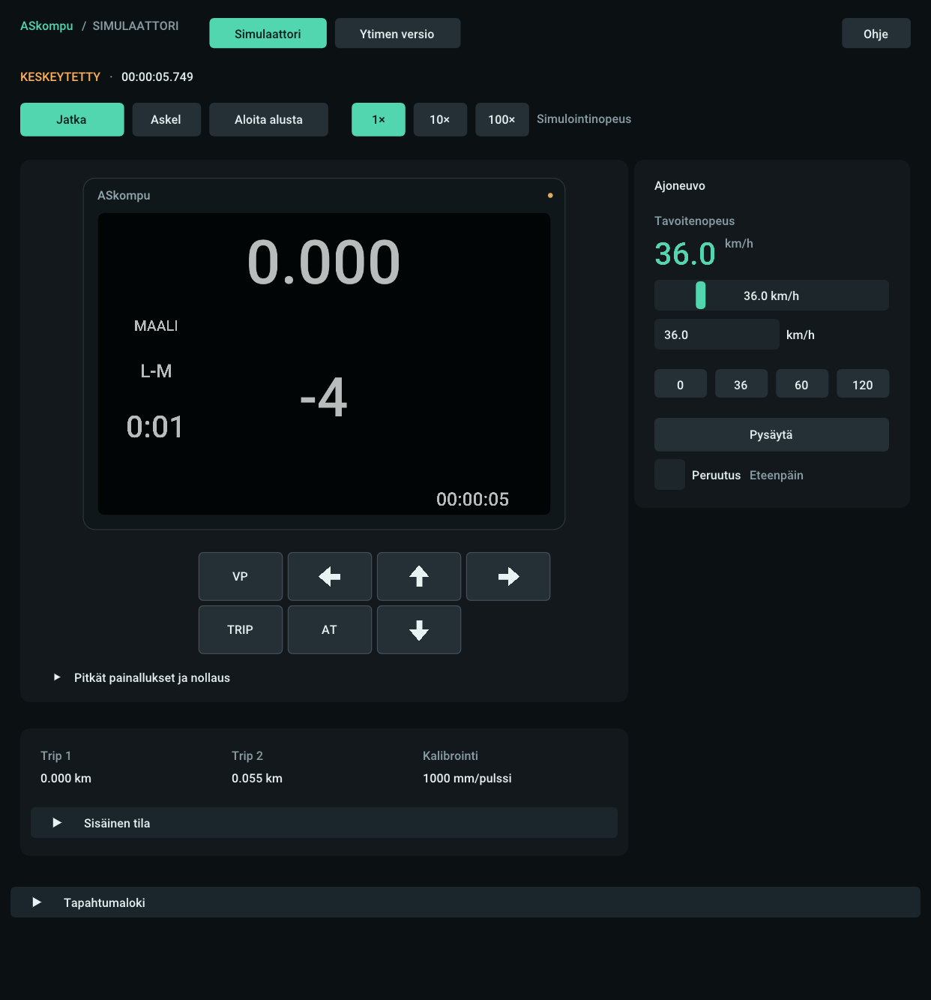
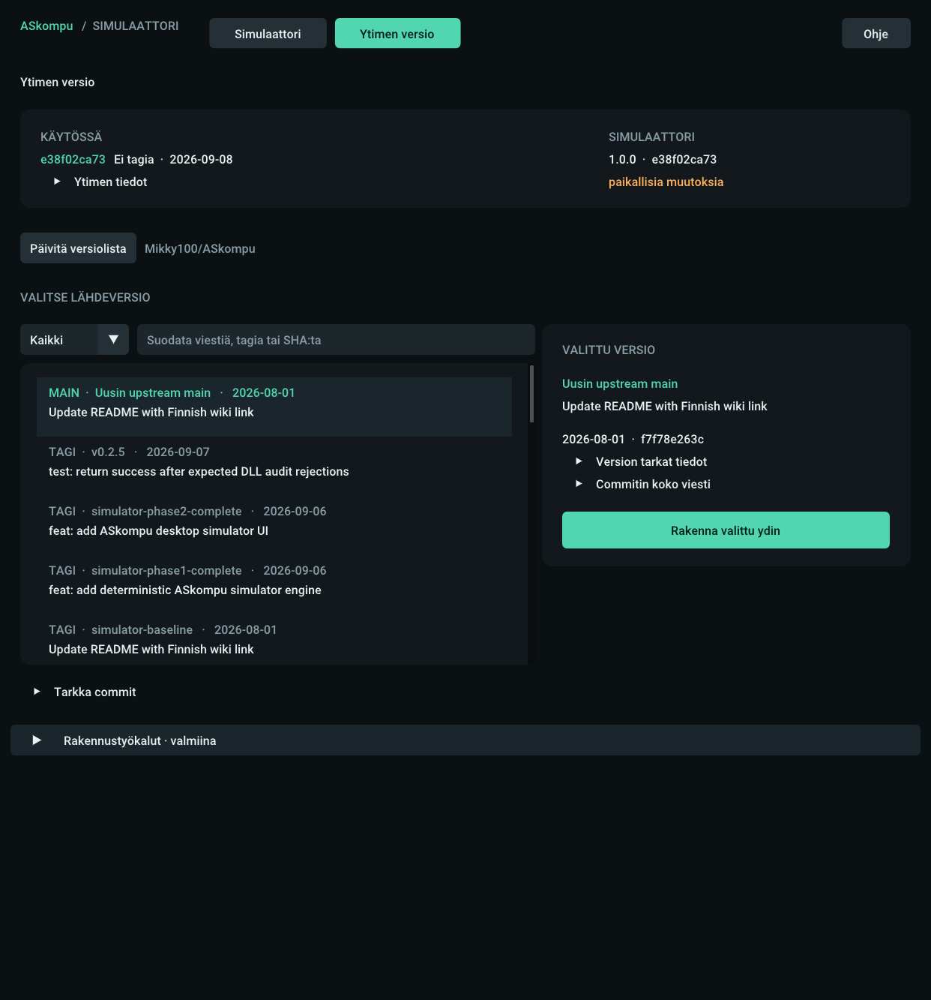

# ASkompu Simulator

A native desktop simulator for the [ASkompu](https://github.com/Mikky100/ASkompu)
time and average-speed calculator. Run its real application core on Windows
or Linux, try route orders, and explore how it responds to speed, time and
button inputs. The application interface is in Finnish.

**[Download ASkompu Simulator 1.0.0](https://github.com/ppqalt/ASkompu-sim/releases/tag/v1.0.0)**

## What you can do

- Operate the actual ASkompu core with simulated speed, wheel pulses and time.
- Pause, step, accelerate time, reverse, reset trips, record points and AT times.
- Use the device layout: **VP · ← · ↑ · →** above **TRIP · AT · ↓**, or keyboard shortcuts.
- Inspect trip readings, application events and diagnostic details.
- Select an upstream GitHub branch tip, tag or exact commit, build and test it
  in isolation, then restart into it. Return to the previous program when needed.

## Start in a minute

**Windows:** download ASkompu-simulaattori-windows-x64.zip, extract the entire
archive, then run ASkompu-simulaattori/askompu-simulaattori.exe.
Normal simulation needs no Python, Git, CMake, PlatformIO or compiler.

**Linux:** extract ASkompu-simulaattori-Linux-x86_64.tar.gz and run
ASkompu-simulaattori/bin/askompu-simulaattori.
The release package is built on Ubuntu 24.04 x64 and uses system C/C++ libraries;
it is not a universal binary for every distribution.

At startup, use ↑/↓ to set the hour; → advances to minutes and then accepts.
Use **Ohje** for help. **Jatka** runs the simulation; **Keskeytä** pauses it.

## Building a different core is optional

**Ytimen versio** lists versions from Mikky100/ASkompu. The selected full SHA is
locked before building; the running program and your source checkout are kept
separate. Tests must pass before restart is offered.

This is a local source-build workflow, not a tool-free automatic updater.
It needs Python 3.10+, Git, CMake 3.25+ and CTest, plus GCC/Make on Linux or
Visual Studio 2022 C++ Build Tools and the Windows SDK on Windows.
Linux also needs the display development libraries described in the
[developer guide](simulator/README.md).

## Scope and limitations

Simulation state lives in memory. Saved scenarios, replay and session transfer
across restarts are not included. Some upstream commits may be incompatible;
a failed build or test prevents switching to them.

This is an independent desktop simulation and development tool, not an official
ASkompu firmware release or a safety-certified vehicle navigation instrument.
Windows 11 manual desktop validation of 1.0.0, including the complete core
build/restart/rollback workflow, remains outstanding. See the
[release notes](https://github.com/ppqalt/ASkompu-sim/releases/tag/v1.0.0)
for the actual automated checks and platform limits.

## Development and credits

[Build and test](simulator/README.md) ·
[Core selector details (Finnish)](simulator/docs/CORE_VERSIONS.md) ·
[Upstream documentation](README-upstream.md) ·
[Upstream wiki](https://github.com/Mikky100/ASkompu/wiki)

Based on ASkompu by **Mikky100**, copyright © 2026 Mikky100, under the
[MIT license](LICENSE). Original production code and ownership notices are
preserved. Simulator-specific development is maintained in this fork by ppqalt.
SDL2, Dear ImGui and Roboto attribution is in
[THIRD_PARTY.md](simulator/THIRD_PARTY.md); packages include their licenses.
